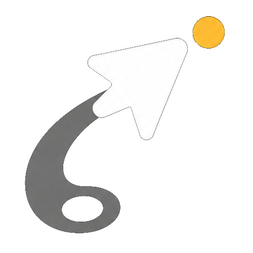

# Gravtail｜重力光标

> 让你的光标知道：你已经坐太久了。

<p align="center">
  
</p>

Gravtail 是一个轻量的 macOS 菜单栏应用。它不靠突然弹出的系统通知打断你，而是把“久坐时间”变成光标本身的环境反馈：使用电脑越久，光标后的 comet（彗尾）越长、越粗，鼠标响应也会逐渐变重；起身离开一段时间后，光标恢复轻盈。

## 为什么要做 Gravtail

传统久坐提醒往往在某个瞬间弹出一条通知，把人从正在做的事情里拽出来。Gravtail 选择了另一种方式：

- **提醒融入正在使用的对象**：光标一直在屏幕上，不需要额外的弹窗或健康面板。
- **变化是渐进的**：你会先看到很轻的 comet，越接近设定时间，轨迹越明显，身体可以自然形成“变重了，该起来走走”的反馈。
- **保持克制**：没有 TODO、打卡、排行榜或生产力评分，核心只做一件事——帮助你离开椅子。

## 核心交互

| 连续使用时间 | 视觉反馈 | 鼠标响应 |
| --- | --- | --- |
| 前半段 | 第一次真实输入后显示很轻的 comet | 保持原始灵敏度 |
| 后半段 | comet 平滑变长、变粗，颜色逐渐变暖 | 逐步降低加速度 |
| 达到设定时间 | 顶部居中的小胶囊提示起身，comet 保持最强 | 达到最重状态，强加重最低约为原响应的 10% |
| 完成休息 | comet 和重量逐渐清除 | 恢复启动前保存的原始设置 |

你可以选择 **45 / 60 / 90 分钟**的连续使用时间，以及 **3 / 5 / 10 分钟**的休息时长。应用启动或重置后，会等到第一次真实的键盘/鼠标输入才开始计时。每 15 分钟，屏幕上方会出现一个短暂的小胶囊，告诉你距离起身还剩多久；到点后胶囊会显示休息倒计时。键盘或鼠标输入会重新开始休息倒计时，完整休息后进入下一轮。

## 视觉语言

Gravtail 的视觉元素都围绕“重量正在增加”这一件事：

```text
轻盈       ·  ·  ·        ───────────────▶       加重
短而清澈的 comet                                  长而厚的 comet
```

- **Comet 光标**：轨迹长度、粗细和下坠感连续变化，不是几个突兀的档位。
- **顶部胶囊**：位于主屏幕上方居中、避开菜单栏和底部语音工具，只显示当前真正需要知道的信息。
- **顶部菜单栏图标**：一个固定在屏幕上方、自动避开 Mac 刘海的 Gravtail 小图标，随时查看下一次起身时间，修改工作/休息时长、Reset Session 或 Quit。

## 灵感与开源致谢

Gravtail 的透明多显示器 overlay、全局光标轨迹和 comet 渲染思路，借鉴了 GitHub 上的 [MouseTrail](https://github.com/changymon/MouseTrail) 项目（Reggie Chang，MIT License）。

我们没有把 MouseTrail 原样复制成一个鼠标特效工具，而是沿用了它“在光标附近绘制轻量视觉层”的技术基础，把它改造成一个以久坐提醒为核心的产品：**轨迹不是为了装饰，而是用来表达光标正在变重。** 具体许可和第三方声明见 [LICENSE](LICENSE) 与 [THIRD_PARTY_NOTICES.md](THIRD_PARTY_NOTICES.md)。

A deliberately small macOS menu bar app: the longer you use your Mac, the heavier its comet cursor becomes. Step away for the selected break duration and it becomes light again.

## Core behavior

- Choose a 45, 60, or 90 minute work interval.
- Choose a 3, 5, or 10 minute break duration.
- After the first physical input, a subtle comet confirms that Gravtail is running while physical pointer response stays unchanged during the first half.
- During the second half, a comet grows continuously and pointer response eases down to 10% at maximum weight.
- Every 15 minutes, a four-second pill reports how long remains before it is time to move.
- At the selected limit, the pill stays visible with a live break countdown and Quit action.
- During that break countdown, the native pointer remains fully usable (including text I-beam hit testing) while the system acceleration stays reduced; keyboard or pointer input simply restarts the countdown.
- Pills sit at the upper center of the main screen, below the menu bar and away from bottom-center voice tools such as Typeless.
- A single small comet/cursor icon is pinned near the center of the top menu-bar strip (automatically avoiding a MacBook notch) and opens work and break settings, Reset Session, and Quit. It remains visible over full-screen apps and never relies on the system's hidden status-item overflow.
- The first physical keyboard or pointer input starts a new work session; any keyboard or pointer input restarts the break countdown.
- Completing the break restores the original pointer response and starts a new session.
- Reset or quit at any time from the menu bar.

## Build and run

Gravtail supports macOS 13 or later and builds a universal app for Apple
silicon and Intel Macs. Install the Xcode Command Line Tools first.

The physical HID cue is capability-detected at runtime because Apple does not
publish that interface as a stable SDK API. If a macOS version or pointing
device does not expose it, Gravtail keeps the comet and leaves native pointer
input unchanged; the menu shows the compatibility status instead of silently
retrying live input.

```sh
./test.sh
./scripts/ensure-local-signing-identity.sh
./build.sh
open ".build/Gravtail.app"
```

The comet works as soon as the first physical input starts a session. Gravtail
can lower the system HID acceleration without Accessibility access, but macOS
Accessibility permission is required for the stronger event-tap weighting that
reaches the intended 10% response. Choose **开启鼠标加重…** from the Gravtail
menu; macOS requests access for the exact running app and offers the direct
System Settings → Privacy & Security → Accessibility route. The request is
throttled to once per app launch so duplicate prompts cannot stack.

When testing a fresh build from a new folder, make sure the exact
`Gravtail.app` you launched is the enabled entry in this list. macOS can keep
an older Gravtail entry enabled while treating a newly moved or rebuilt copy
as a separate accessibility client.

Gravtail never applies its two weighting implementations at the same time:
the precise software transform is used during active work, and the native-
cursor HID path is used only during the break countdown so text I-beam hit
testing remains intact. Both paths preserve at least 10% response; Gravtail
never intentionally writes zero acceleration. The original HID values are
backed up before a change and restored after a completed break or normal quit.
Before the first HID change, Gravtail starts a small independent recovery
watchdog. If the main app crashes or is force-killed during a break, the
watchdog restores the saved values automatically. A persistent backup remains
as a second recovery layer. A local build also exposes an explicit emergency
command:

```sh
".build/Gravtail.app/Contents/MacOS/HeavyCursor" --restore-hid
```

The app measures physical keyboard and pointer inactivity from macOS HID
events; window redraws, notifications, and changing message content do not
count as work input. It cannot verify whether a person physically stood up.
The configured break duration is therefore a practical inactivity-based proxy
for taking a break.

For troubleshooting, Gravtail records only state transitions—not keyboard
content, pointer coordinates, or browsing activity—in
`~/Library/Logs/Gravtail/Gravtail.log`.

## 下载与安装（免费社区版）

社区版不要求每个用户信任作者的私有自签名身份，而是在每台 Mac 上创建独立的本地签名：

1. 从 GitHub Releases 下载并完整解压 `Gravtail-*-macOS.zip`。
2. 按住 Control 点击 **安装 Gravtail.command**，选择“打开”。
3. 安装程序会在当前用户的登录钥匙串中创建或复用 `Gravtail Local`，在本机重新签名，并把 App 安装到固定的 Applications 路径。
4. 安装完成后直接打开 `Gravtail.app`。安装器会先验证下载包和本地签名，再移除 App 的下载隔离标记，因此不再要求第二次按住 Control 打开。
5. 点击顶部 Gravtail 图标 → **开启鼠标加重…**，在“系统设置 → 隐私与安全性 → 辅助功能”中打开 Gravtail。

私钥只留在这台 Mac，不会上传给项目作者或 GitHub；证书也只被信任用于代码签名。安装脚本不能代替用户授予辅助功能权限。更新时先退出 Gravtail，再运行新版本中的同一个安装脚本；它会复用同一证书、Bundle ID 和安装路径，让 macOS 尽可能把更新识别为同一个 App。不要删除钥匙串中的 `Gravtail Local`。完整说明见 [COMMUNITY_INSTALL.md](COMMUNITY_INSTALL.md)。

For a local, non-persistent preview of the full 45-minute effect:

```sh
open ".build/Gravtail.app" --args --preview-45
```

Preview mode does not automatically open the Accessibility permission prompt.
If you want to test physical pointer weighting, choose **开启鼠标加重…** from
the menu-bar icon once, or grant Gravtail access manually
in System Settings.

To preview a 15-minute progress pill without waiting:

```sh
open ".build/Gravtail.app" --args --preview-ui --preview-progress
```

## 打包社区版本

```sh
./scripts/ensure-local-signing-identity.sh
./package.sh
```

这会在 `dist/` 中生成通用架构的社区安装包、可重新构建的源码包和 `SHA256SUMS.txt`。维护者构建会先完成完整性签名；下载者运行安装脚本时，再用该 Mac 私有的 `Gravtail Local` 身份替换签名。

To use a named fixed self-signed identity, pass that identity explicitly:

```sh
SIGNING_IDENTITY="Gravtail Local" ./package.sh
```

维护者的私钥不会进入发布包。每个下载副本通过持续复用用户自己的本地证书，在该 Mac 上保持稳定身份。由于 App 没有经过 Apple 公证，第一次运行下载得到的安装脚本时，“按住 Control 点击 → 打开”仍是免费发行路线无法省略的步骤；通过验证的 App 本身无需再重复一次。

## Attribution

The transparent multi-display overlay and comet approach are based on [MouseTrail](https://github.com/changymon/MouseTrail) by Reggie Chang, used under the MIT License. See `LICENSE` and `THIRD_PARTY_NOTICES.md`.
